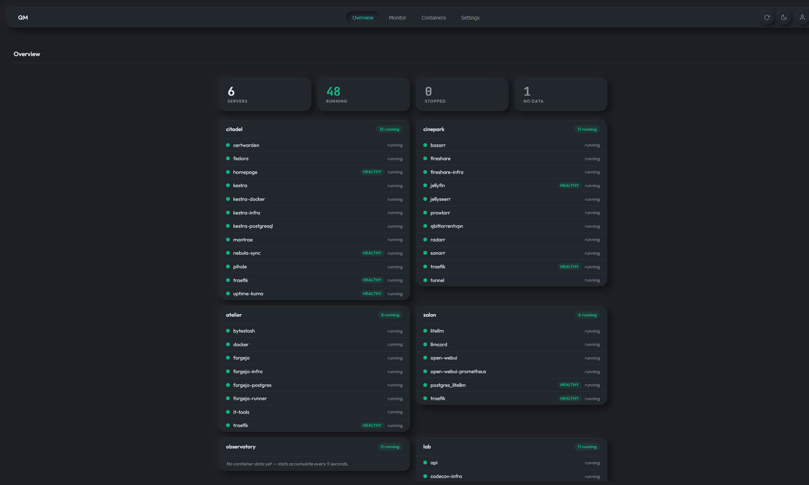
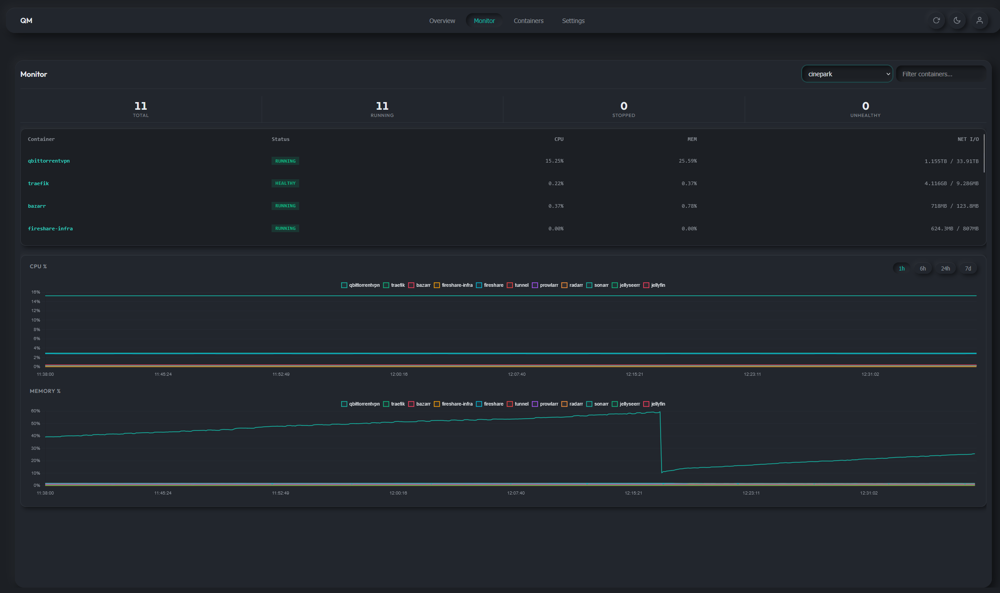
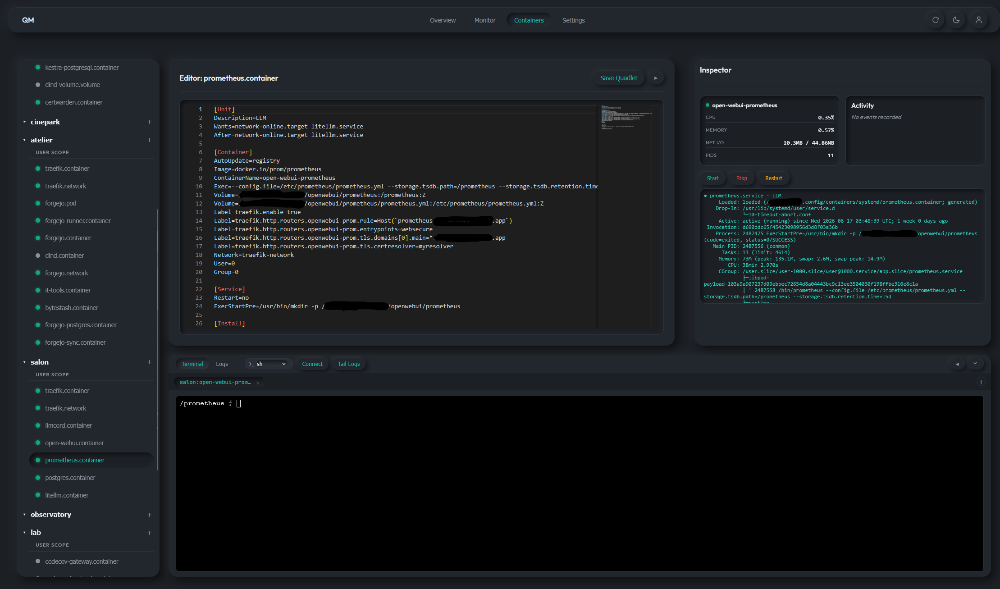
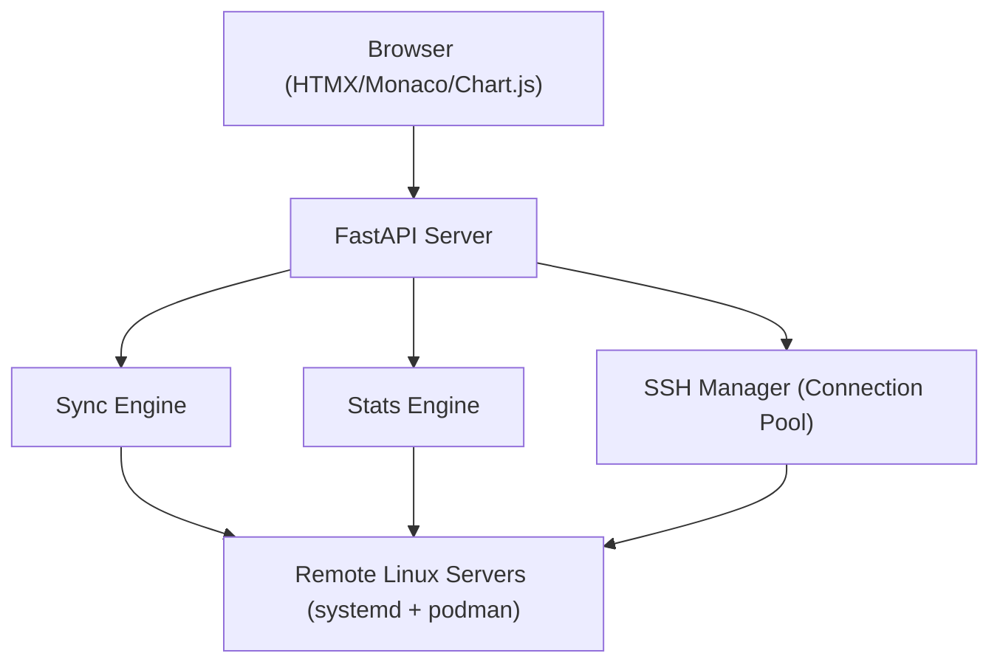

# QuadletManager


[](https://codecov.io/gh/karoltheguy/QuadletManager)
[](https://app.codacy.com/gh/karoltheguy/QuadletManager/dashboard?utm_source=gh&utm_medium=referral&utm_content=&utm_campaign=Badge_grade)

Manage Podman Quadlets across multiple Linux servers through SSH connections.

**Disclaimer**
This has been developed with help of Claude and Gemini.
I'm an old timer developer with most experience in c# then c++, not much frontend development except for ugly UI with .Net or QT.
All the above led me to choose htmx and python. I felt that htmx left most of the power to the backend and also less learning for me to assure a minimum learning to perform proper QA.

I first started my development in my homelab Forgejo repository but as I want to be as transparent as possible, I've transfered everything in Github (all issues and Git commit history).

## Features

- Manage servers over SSH without installing remote agents
- Control quadlets on multiple Linux servers from a single interface
- Edit files, navigate directories, and view systemd status simultaneously
- Stream live logs and monitor CPU, memory, and container health
- Sync external file changes automatically
- Assign viewer (read-only) or editor (full access) roles
- Store SSH private keys with AES-256-GCM encryption
- Start, stop, and restart Podman `.pod` quadlets directly
- Create quadlets using built-in templates

## Screenshots

### Dashboard View



### Monitoring Tab



### Editor View



### Settings View

`[Insert screenshot of settings view]`

## Requirements

- Python 3.12+
- Remote Linux servers with systemd and Podman installed
- SSH access to managed servers (key-based authentication)

## Installation

### From Source

```bash
git clone <repository-url>
cd QuadletManager
python3 -m venv venv
source venv/bin/activate
pip install -r requirements.txt
```

### Container (Docker Compose)

```bash
QUADLET_MASTER_KEY=$(openssl rand -hex 32) docker compose up -d
```

### Container (Podman Quadlet)

Copy `quadletmanager.container` to `~/.config/containers/systemd/` (rootless) or `/etc/containers/systemd/` (rootful), then:

```bash
systemctl --user daemon-reload
systemctl --user start quadletmanager
```

## Configuration

### Master Key

The master key is used to encrypt and decrypt SSH private keys stored in the database. Set it via environment variable or `config.yaml`:

```bash
export QUADLET_MASTER_KEY=$(openssl rand -hex 32)
```

### config.yaml

```yaml
master_key: "your-64-char-hex-master-key"
session_timeout: 3600
poll_frequency: 10
dev_auto_login: false
```

### Environment Variables

| Variable | Description |
|----------|-------------|
| `QUADLET_MASTER_KEY` | AES-256 master key (64 hex characters) |
| `QUADLET_CONFIG_PATH` | Path to config YAML file (default: `config.yaml`) |
| `QUADLET_DB_PATH` | Path to SQLite database file (default: `quadlets.db`) |
| `LOG_LEVEL` | Logging level: `DEBUG`, `INFO`, `WARNING`, `ERROR` |

## Running

```bash
source venv/bin/activate
export QUADLET_MASTER_KEY=$(openssl rand -hex 32)
uvicorn main:app --host 0.0.0.0 --port 8000
```

On first startup, the database is seeded with two default users:

| Username | Password | Role |
|----------|----------|------|
| `admin` | `admin` | Editor |
| `viewer` | `viewer` | Viewer |

Change these passwords before deploying to production.

## Remote Server Setup

On each target server, create a dedicated user and grant passwordless sudo for the specific commands QuadletManager needs.

> [!IMPORTANT]
> **Managing the Local Host (Loopback Connection):**
> If you are running QuadletManager inside a container (using Podman/Docker) and want to manage the host machine it is running on:
> - Do not use `localhost` or `127.0.0.1` as the server IP, as that refers to the container itself.
> - For **Podman**, use **`host.containers.internal`** as the IP/hostname in the settings panel.
> - For **Docker**, use **`host.docker.internal`** (you may need to add `extra_hosts: ["host.docker.internal:host-gateway"]` to your `docker-compose.yml` or container configuration flags on Linux).
> - Make sure the host's SSH service is running, and your public SSH key is added to the host's `authorized_keys` file.

### 1. Create the SSH User

```bash
sudo useradd -m -s /bin/bash quadlet-agent
```

Add your QuadletManager public SSH key to `/home/quadlet-agent/.ssh/authorized_keys`.

### 2. Sudoers Configuration (Global Scope Only)

For rootless (user) scope quadlets, no sudo is required. For global scope quadlets, create `/etc/sudoers.d/quadlet-manager`:

```bash
quadlet-agent ALL=(ALL) NOPASSWD: /usr/bin/systemctl daemon-reload
quadlet-agent ALL=(ALL) NOPASSWD: /usr/bin/systemctl start *
quadlet-agent ALL=(ALL) NOPASSWD: /usr/bin/systemctl stop *
quadlet-agent ALL=(ALL) NOPASSWD: /usr/bin/systemctl restart *
quadlet-agent ALL=(ALL) NOPASSWD: /usr/bin/systemctl status *
quadlet-agent ALL=(ALL) NOPASSWD: /usr/bin/journalctl -u *
quadlet-agent ALL=(ALL) NOPASSWD: /usr/bin/tee /etc/containers/systemd/*
quadlet-agent ALL=(ALL) NOPASSWD: /usr/bin/podman stats *
```

### 3. Quadlet File Paths

| Scope | Path on Remote Server | Sudo Required |
|-------|----------------------|---------------|
| User (rootless) | `~/.config/containers/systemd/` | No |
| Global (rootful) | `/etc/containers/systemd/` | Yes |

## Testing

See [docs/TESTING.md](docs/TESTING.md) for the full testing guide.

### Unit Tests

```bash
pip install -r requirements-test.txt
PYTHONPATH=. pytest tests/ --ignore=tests/e2e/
```

### E2E Tests (requires running backend + Chromium)

```bash
playwright install chromium
PYTHONPATH=. pytest tests/e2e/
```

### With Coverage

```bash
PYTHONPATH=. pytest tests/ --ignore=tests/e2e/ --cov=. --cov-report=term-missing
```

## Architecture



- **Backend**: FastAPI (Python) with asyncssh for SSH connection pooling
- **Frontend**: HTMX for server-driven UI updates, Monaco Editor for file editing, Chart.js for resource visualization
- **Database**: SQLite with AES-256-GCM encrypted SSH key storage
- **Real-time**: Server-Sent Events for stats/sync updates, WebSocket for log streaming

Full architecture documentation: [docs/ARCHITECTURE.md](docs/ARCHITECTURE.md)

## API Reference

| Method | Path | Description |
|--------|------|-------------|
| POST | `/login` | Submit credentials |
| GET | `/logout` | Clear session |
| GET | `/` | Main dashboard |
| GET | `/api/servers` | Server list |
| GET | `/api/quadlets/{server_id}` | File tree for a server |
| GET | `/api/file/{server_id}` | File content |
| POST | `/api/save` | Save file content |
| POST | `/api/create` | Create new quadlet |
| GET | `/api/systemctl/status/{server_id}` | Get unit status |
| POST | `/api/systemctl/{server_id}` | Execute systemctl action (start/stop/restart) |
| POST | `/api/pod-action/{server_id}` | Execute pod action |
| GET | `/api/health/history/{server_id}` | Container health history |
| GET | `/api/events` | SSE stream for real-time updates |
| WS | `/ws/logs/{server_id}/{unit_name}` | Log streaming |

Full API documentation: [docs/ARCHITECTURE.md](docs/ARCHITECTURE.md#api-reference)

## Documentation

- [docs/ARCHITECTURE.md](docs/ARCHITECTURE.md) -- system architecture, component details, API reference
- [docs/SETUP.MD](docs/SETUP.MD) -- remote server setup guide
- [docs/TESTING.md](docs/TESTING.md) -- test structure and writing guide
- [docs/REQUIREMENTS.MD](docs/REQUIREMENTS.MD) -- original requirements specification
