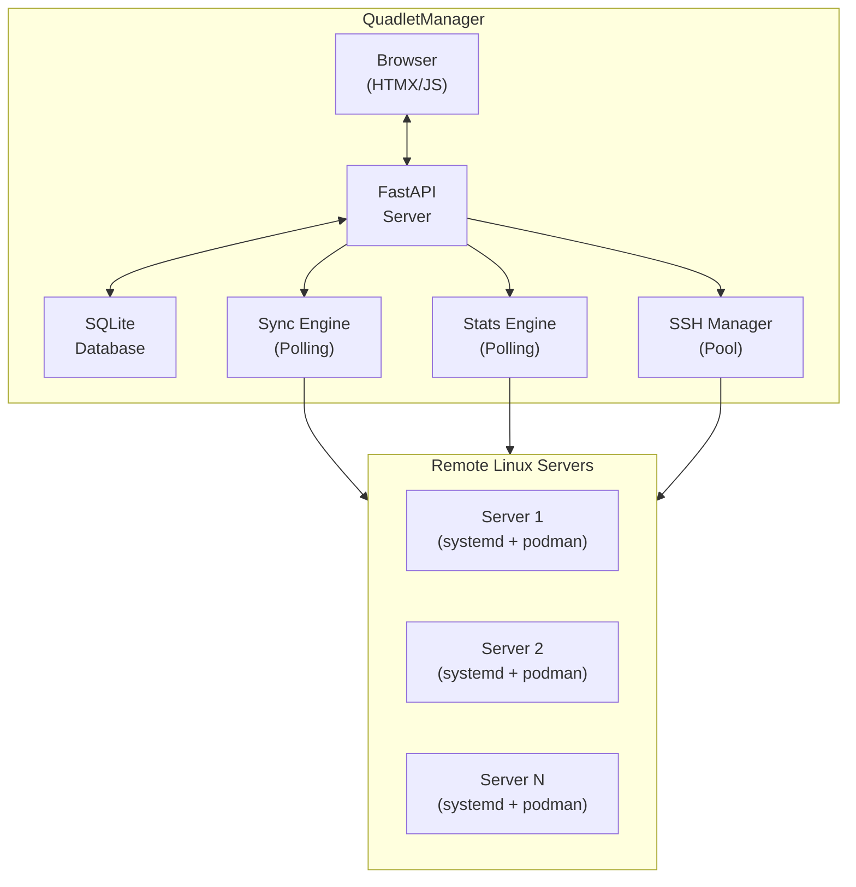
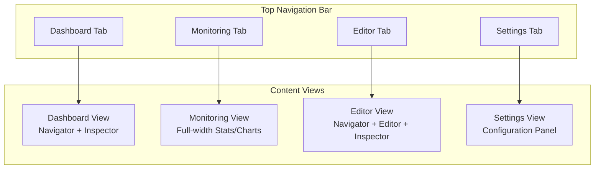
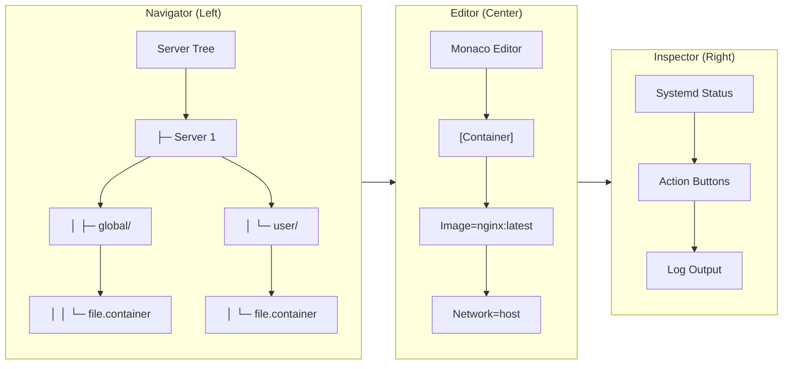
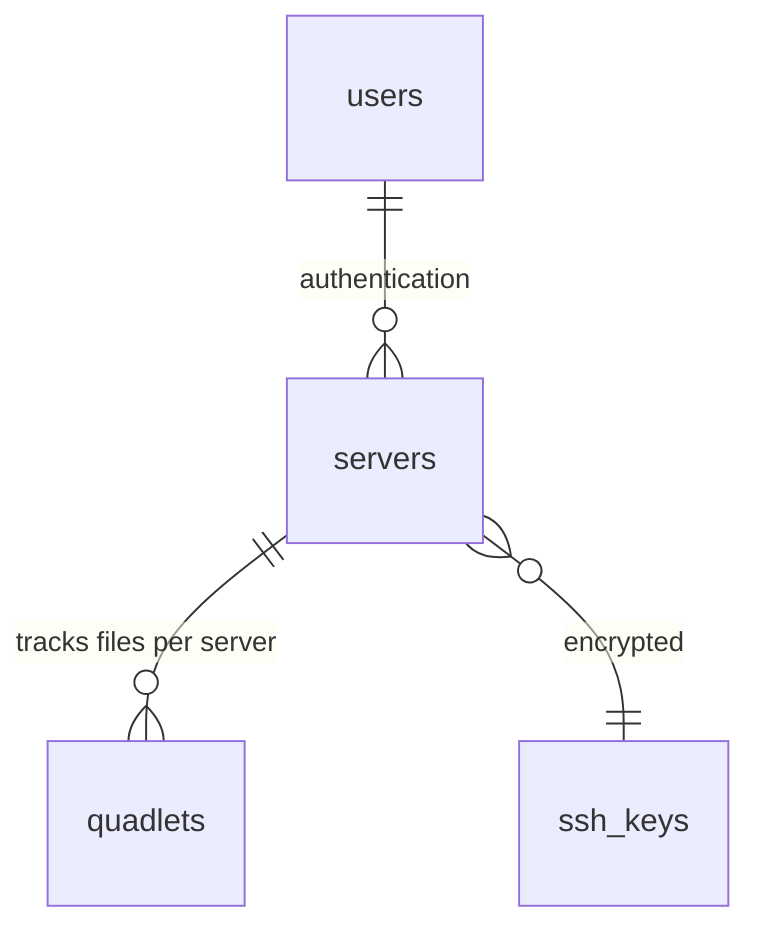
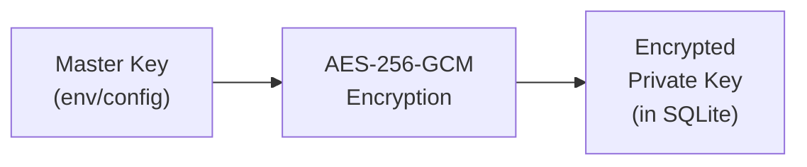
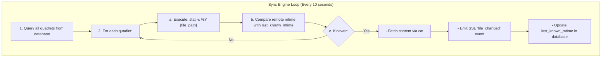

# QuadletManager Architecture

## Overview

QuadletManager is a self-hosted, agentless web dashboard for managing Podman Quadlets on multiple remote Linux servers via systemd. Built with FastAPI (Python) on the backend and HTMX + Monaco Editor on the frontend, it provides real-time synchronization, monitoring, and control of container workloads without requiring any agent software on managed servers.

## Table of Contents

1. [System Architecture](#system-architecture)
2. [Backend Components](#backend-components)
3. [Frontend Components](#frontend-components)
4. [Data Layer](#data-layer)
5. [Security Model](#security-model)
6. [Real-time Communication](#real-time-communication)
7. [Background Services](#background-services)
8. [API Reference](#api-reference)
9. [Deployment](#deployment)

---

## System Architecture

### High-Level Diagram


    
    ### Key Design Principles

- **Agentless**: No software installed on managed servers; all operations via SSH
- **Event-Driven**: Real-time UI updates via Server-Sent Events (SSE)
- **Connection Pooling**: Persistent SSH connections to avoid re-authentication overhead
- **Role-Based Access Control**: Viewer and Editor roles with strict backend enforcement

---

## Backend Components

### Directory Structure

```
├── main.py                    # FastAPI application entry point
├── api/
│   ├── routes.py              # HTTP routes and WebSocket endpoints
│   └── sockets.py             # WebSocket handlers for log streaming
├── core/
│   ├── config_loader.py       # YAML configuration loader
│   ├── crypto.py              # AES-256-GCM encryption for SSH keys
│   ├── database.py            # SQLite schema and connection management
│   └── events_manager.py      # SSE publisher/subscriber system
└── services/
    ├── ssh_manager.py # SSH connection pool (asyncssh)
    ├── sync_engine.py # File modification polling engine
    ├── stats_engine.py # Podman stats polling engine
    ├── systemd_manager.py # systemctl command wrappers
    ├── tree_scanner.py # Quadlet file tree discovery
    └── quadlet_parser.py # Quadlet file parsing utilities
tests/
├── test_stats_engine.py # Stats engine unit tests (pytest-asyncio)
├── test_sync_engine.py # Sync engine unit tests (pytest-asyncio)
├── test_rbac.py # RBAC permission tests (pytest-asyncio)
├── test_new_quadlet_modal.py # Modal UI tests (pytest-asyncio)
├── test_sockets.py # WebSocket tests (pytest-asyncio)
└── ... # Other test files
```

### Core Modules

#### [`main.py`](main.py)

Application bootstrap and lifecycle management:
- FastAPI app initialization
- Static file mounting
- Background task coordination (sync engine, stats engine)
- Graceful shutdown handling

#### [`api/routes.py`](api/routes.py)

HTTP endpoints for:
- Authentication (login/logout with signed session cookies)
- Dashboard rendering
- File CRUD operations
- Systemctl actions (start/stop/restart/status)
- Server-Sent Events (SSE) stream

#### [`services/ssh_manager.py`](services/ssh_manager.py)

SSH connection pool implementation:
- Connection caching per server
- Automatic reconnection on failure
- Timeout handling with remote process cleanup
- Sudo command prefixing for rootful operations

---

## Frontend Components

### Technology Stack

- **HTMX 1.9.11**: Declarative AJAX and DOM updates
- **Monaco Editor 0.45.0**: Code editing with syntax highlighting
- **Chart.js 4.4.1**: Resource usage visualization
- **Tailwind CSS**: Utility-first styling

### Tabbed Navigation

The dashboard uses a tabbed navigation system with four main views:



### Three-Pane Layout (Dashboard/Editor Views)



### Monitoring View

The dedicated Monitoring tab provides full-width container resource visualization:

- **Server Selector**: Dropdown to select which server's stats to display
- **Resource Chart**: Bar chart showing CPU and Memory usage per container
- **Stats Table**: Detailed table with CPU, Memory, Network I/O, and PIDs
- **Health History Chart**: Stepped line chart showing running (1) vs stopped (0) state per container over time, with 15m/30m/1h time-range selectors. Data is fetched from `GET /api/health/history/{server_id}?minutes=N`

### Key Files

| File | Purpose |
|------|---------|
| [`templates/dashboard.html`](templates/dashboard.html) | Main layout with tabbed navigation and panes |
| [`templates/partials/editor_pane.html`](templates/partials/editor_pane.html) | Monaco editor container and action buttons |
| [`templates/partials/quadlet_tree.html`](templates/partials/quadlet_tree.html) | Server/file tree navigation with status dots |
| [`templates/partials/servers_list.html`](templates/partials/servers_list.html) | Server list rendering |
| [`static/main.js`](static/main.js) | Monaco initialization, SSE handling, chart updates, tab switching |
| [`static/style.css`](static/style.css) | Custom styles, dark theme, and view control classes |

---

## Data Layer

### Database Schema (SQLite)

```sql
-- Users with role-based access
CREATE TABLE users (
    id INTEGER PRIMARY KEY AUTOINCREMENT,
    username TEXT UNIQUE NOT NULL,
    password_hash TEXT NOT NULL,
    role TEXT NOT NULL CHECK(role IN ('viewer', 'editor'))
);

-- SSH key storage (encrypted)
CREATE TABLE ssh_keys (
    id INTEGER PRIMARY KEY AUTOINCREMENT,
    key_name TEXT UNIQUE NOT NULL,
    encrypted_private_key BLOB NOT NULL
);

-- Registered servers
CREATE TABLE servers (
    id INTEGER PRIMARY KEY AUTOINCREMENT,
    name TEXT NOT NULL,
    ip_address TEXT NOT NULL,
    ssh_user TEXT NOT NULL,
    ssh_key_id INTEGER,
    FOREIGN KEY(ssh_key_id) REFERENCES ssh_keys(id)
);

-- Tracked Quadlet files
CREATE TABLE quadlets (
    id INTEGER PRIMARY KEY AUTOINCREMENT,
    server_id INTEGER NOT NULL,
    file_path TEXT NOT NULL,
    scope TEXT NOT NULL CHECK(scope IN ('global', 'user')),
    last_known_mtime INTEGER,
    last_content_hash TEXT,
    FOREIGN KEY(server_id) REFERENCES servers(id)
);

-- Boilerplate templates
CREATE TABLE templates (
    id INTEGER PRIMARY KEY AUTOINCREMENT,
    name TEXT NOT NULL,
    type TEXT NOT NULL CHECK(type IN ('container', 'volume', 'network', 'pod')),
    content TEXT NOT NULL
);

-- Container health snapshots (1-hour rolling window, written every 5s poll cycle)
CREATE TABLE container_health_history (
    id INTEGER PRIMARY KEY AUTOINCREMENT,
    server_id INTEGER NOT NULL,
    container_name TEXT NOT NULL,
    is_running INTEGER NOT NULL DEFAULT 1,  -- 1 = running, 0 = stopped
    cpu_pct REAL DEFAULT 0,
    mem_pct REAL DEFAULT 0,
    recorded_at INTEGER NOT NULL,           -- Unix timestamp
    FOREIGN KEY(server_id) REFERENCES servers(id)
);
CREATE INDEX idx_health_history_server_time ON container_health_history(server_id, recorded_at);
```

### Entity Relationships



---

## Security Model

### Authentication

- **Session Management**: Signed cookies using `itsdangerous.URLSafeTimedSerializer`
- **Password Hashing**: SHA-256 (to be upgraded to bcrypt/argon2)
- **Session Timeout**: Configurable (default: 1 hour)

### SSH Key Protection



- Master key stored in environment variable or config file
- Private keys encrypted before database storage
- Decryption only in memory during SSH session lifecycle
- See [`core/crypto.py`](core/crypto.py) for implementation

### RBAC Enforcement

| Role | Permissions |
|------|-------------|
| `viewer` | Read file tree, view logs, view stats |
| `editor` | Full CRUD, start/stop/restart services |

Permission checks in [`api/routes.py`](api/routes.py):
```python
if role != "editor":
    raise HTTPException(status_code=403, detail="Viewer role cannot save files.")
```

### Sudo Configuration

For rootful (global) scope operations, the app prepends `sudo` to commands. Remote servers require sudoers configuration:

```bash
# /etc/sudoers.d/quadlet-manager
quadletuser ALL=(ALL) NOPASSWD: /usr/bin/systemctl daemon-reload
quadletuser ALL=(ALL) NOPASSWD: /usr/bin/systemctl start *
quadletuser ALL=(ALL) NOPASSWD: /usr/bin/systemctl stop *
quadletuser ALL=(ALL) NOPASSWD: /usr/bin/systemctl restart *
quadletuser ALL=(ALL) NOPASSWD: /usr/bin/systemctl status *
quadletuser ALL=(ALL) NOPASSWD: /usr/bin/cat /etc/containers/systemd/*
quadletuser ALL=(ALL) NOPASSWD: /usr/bin/tee /etc/containers/systemd/*
quadletuser ALL=(ALL) NOPASSWD: /usr/bin/podman stats *
```

---

## Real-time Communication

### Server-Sent Events (SSE)

Endpoint: `GET /api/events`

Event types:
- `stats_update`: Container resource metrics (every 5s)
- `stats_error`: Podman connectivity issues
- `file_changed`: External file modification detected

```javascript
// Client-side SSE handling (static/main.js)
var evtSource = new EventSource('/api/events');
evtSource.addEventListener('stats_update', function(e) {
    var data = JSON.parse(e.data);
    updateStats(data);
});
```

### Browser Notifications

The frontend leverages the native HTML5 Notification API to alert users of state changes even when the dashboard tab is in the background:
- **Action Watches**: When a user triggers `start`, `restart`, or `save`, the frontend tracks the action and checks the next SSE update. It emits a success toast or dynamically fetches `systemctl status` to extract and display the specific failure reason.
- **Spontaneous Failures**: By diffing the set of running containers on every SSE `stats_update`, the application alerts the user globally if a quadlet stops or fails unexpectedly without manual intervention.

### WebSocket (Logs)

Endpoint: `WS /ws/logs/{server_id}/{unit_name}`

Real-time log streaming via `journalctl -f`:
- Client sends `STOP` to terminate stream
- Server kills remote process on disconnect
- See [`api/sockets.py`](api/sockets.py) for implementation

---

## Background Services

### Sync Engine ([`services/sync_engine.py`](services/sync_engine.py))



### Stats Engine ([`services/stats_engine.py`](services/stats_engine.py))

```mermaid
flowchart TD
    subgraph StatsLoop["Stats Engine Loop (Every 5 seconds)"]
        A["1. Query all servers from database"]
        B["2. For each server:"]
        C["a. Execute: podman ps --format '{{.Names}}'"]
        D["b. Execute: podman stats --no-stream --format json"]
        E["c. Normalize and parse JSON"]
        F["d. Emit SSE 'stats_update' event"]
        G["e. Persist health snapshot to container_health_history"]
        H["Handles both rootless and rootful containers"]

        A --> B
        B --> C
        C --> D
        D --> E
        E --> F
        F --> G
        G --> H
    end
```



---

## API Reference

### Authentication Endpoints

| Method | Path | Description |
|--------|------|-------------|
| GET | `/login` | Login page |
| POST | `/login` | Submit credentials |
| GET | `/logout` | Clear session |

### Dashboard Endpoints

| Method | Path | Description |
|--------|------|-------------|
| GET | `/` | Main dashboard |
| GET | `/api/servers` | Server list (HTML partial) |
| GET | `/api/quadlets/{server_id}` | File tree (HTML partial) |
| GET | `/api/file/{server_id}` | File content (HTML partial) |

### File Operations

| Method | Path | Description |
|--------|------|-------------|
| POST | `/api/save` | Save file content |
| POST | `/api/create` | Create new quadlet |

### Systemctl Endpoints

| Method | Path | Description |
|--------|------|-------------|
| GET | `/api/systemctl/status/{server_id}` | Get unit status |
| POST | `/api/systemctl/{server_id}` | Execute action (start/stop/restart) |

### Monitoring Endpoints

| Method | Path | Description |
|--------|------|-------------|
| GET | `/api/health/history/{server_id}` | Per-container health history (`?minutes=N`, default 60) |

### Real-time Endpoints

| Method | Path | Description |
|--------|------|-------------|
| GET | `/api/events` | SSE stream |
| WS | `/ws/logs/{server_id}/{unit_name}` | Log streaming |

---

## Deployment

### Configuration ([`config.yaml`](config.yaml))

```yaml
# Application configuration
master_key: "your-64-char-hex-master-key"
dev_auto_login: false
session_timeout: 3600
polling_interval: 10
stats_interval: 5
```

### Environment Variables

| Variable | Description |
|----------|-------------|
| `QUADLET_MASTER_KEY` | AES-256 master key (64 hex chars) |
| `LOG_LEVEL` | Logging level (DEBUG, INFO, WARNING, ERROR) |

### Running the Application

```bash
# Install dependencies
pip install -r requirements.txt

# Set master key
export QUADLET_MASTER_KEY=$(openssl rand -hex 32)

# Run server
uvicorn main:app --host 0.0.0.0 --port 8000
```

### Docker Deployment

```yaml
# docker-compose.yml
version: '3.8'
services:
  quadlet-manager:
    build: .
    ports:
      - "8000:8000"
    volumes:
      - ./config.yaml:/app/config.yaml
      - ./quadlets.db:/app/quadlets.db
    environment:
      - QUADLET_MASTER_KEY=${QUADLET_MASTER_KEY}
```

---

## Future Considerations

### Planned Improvements

1. **Multi-user Sessions**: Concurrent editing with conflict resolution
2. **Audit Logging**: Track who changed what and when
3. **Backup/Restore**: Snapshot quadlet configs before edits
4. **API Documentation**: OpenAPI/Swagger auto-generation
5. **Container Image**: Official Docker/Podman image

### Security Enhancements

1. Upgrade password hashing to bcrypt/argon2
2. Implement CSRF protection
3. Add rate limiting on authentication endpoints
4. Support SSH key passphrase protection

---

### Testing

The project uses pytest with pytest-asyncio for async test support. All async tests use the native pytest-asyncio style with `@pytest.mark.asyncio` decorator rather than `unittest.IsolatedAsyncioTestCase` to avoid event loop conflicts.

Running tests:
```bash
# Install test dependencies
pip install pytest pytest-asyncio

# Run all tests
pytest

# Run specific test file
pytest tests/test_stats_engine.py -v
```

---

*Document last updated: 2026-03-22 — Health history feature added (issue #18)*
