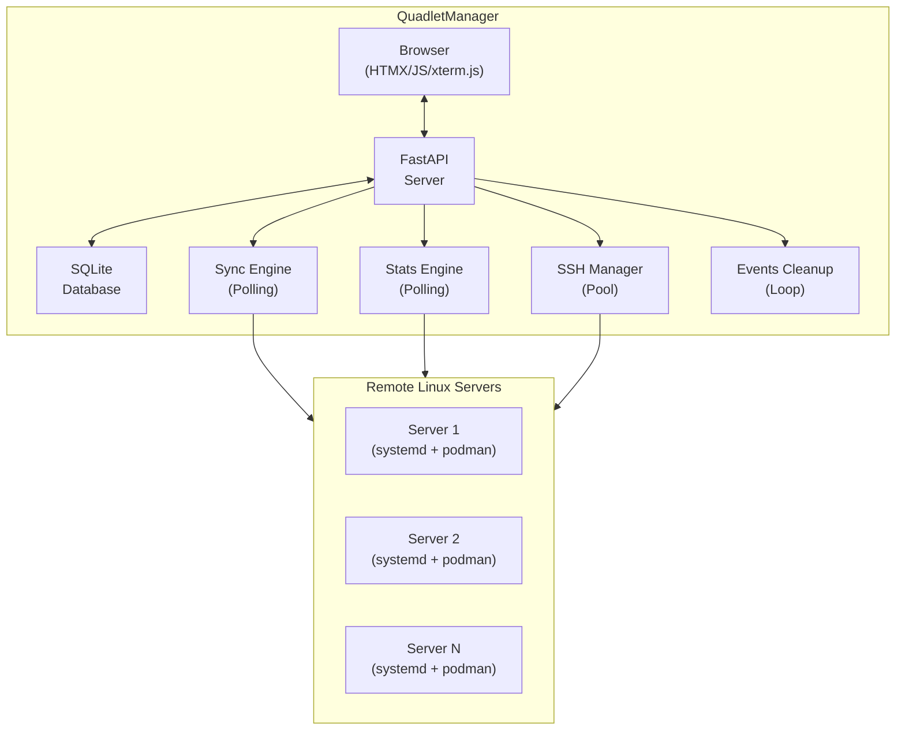
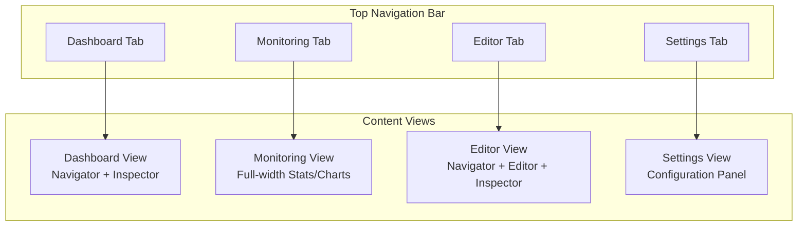
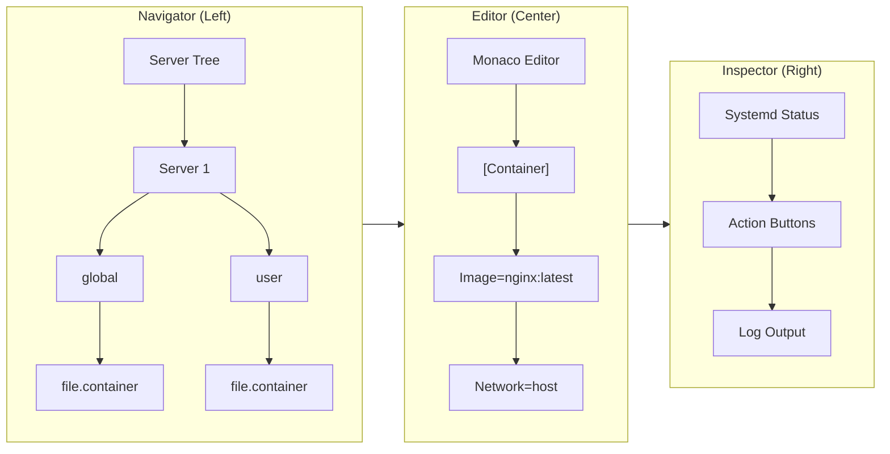
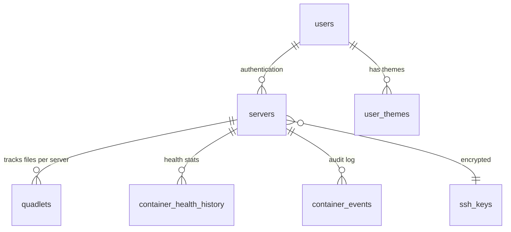
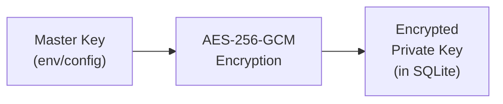
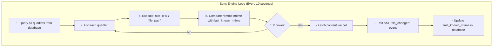
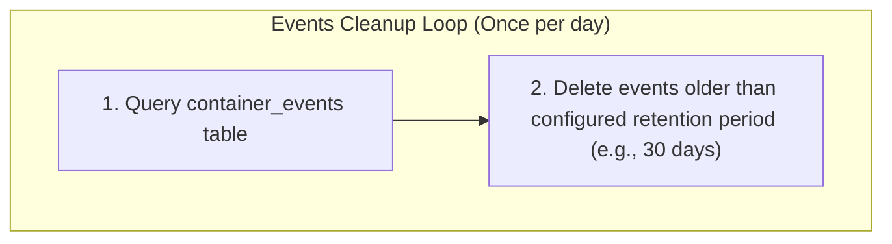

# QuadletManager Architecture

## Overview

QuadletManager is an agentless web dashboard for managing Podman Quadlets across multiple remote Linux servers. Built with FastAPI on the backend and powered by HTMX, Monaco Editor, and xterm.js on the frontend, it enables real-time synchronization of Quadlet files, container monitoring, and interactive terminal sessions directly through your browser. No software needs to be installed on the managed nodes.

## Table of Contents

1. [System Architecture](#system-architecture)
2. [Backend Components](#backend-components)
3. [Frontend Components](#frontend-components)
4. [Data Layer](#data-layer)
5. [Security Model](#security-model)
6. [Real-time Communication](#real-time-communication)
7. [Background Services](#background-services)
8. [API Reference](#api-reference)
9. [Deployment](#deployment)

---

## System Architecture

### High-Level Diagram


    
    ### Key Design Principles

- **Agentless**: No software installed on managed servers; all operations via SSH
- **Event-Driven**: Real-time UI updates via Server-Sent Events (SSE)
- **Connection Pooling**: Persistent SSH connections to avoid re-authentication overhead
- **Role-Based Access Control**: Viewer and Editor roles with strict backend enforcement

---

## Backend Components

### Directory Structure

```
├── main.py                    # FastAPI application entry point
├── api/
│   ├── routes.py              # HTTP routes and WebSocket endpoints
│   └── sockets.py             # WebSocket handlers for log streaming and interactive exec sessions
├── core/
│   ├── config_loader.py       # YAML configuration loader
│   ├── crypto.py              # AES-256-GCM encryption for SSH keys
│   ├── database.py            # SQLite schema and connection management
│   └── events_manager.py      # SSE publisher/subscriber system
└── services/
    ├── container_events.py # Container events tracking and cleanup
    ├── ssh_manager.py # SSH connection pool (asyncssh)
    ├── sync_engine.py # File modification polling engine
    ├── stats_engine.py # Podman stats polling engine
    ├── systemd_manager.py # systemctl command wrappers
    ├── tree_scanner.py # Quadlet file tree discovery
    ├── quadlet_parser.py # Quadlet file parsing utilities
    └── quadlet_validator.py # Remote Quadlet dry-run validation
tests/
├── test_stats_engine.py # Stats engine unit tests (pytest-asyncio)
├── test_sync_engine.py # Sync engine unit tests (pytest-asyncio)
├── test_rbac.py # RBAC permission tests (pytest-asyncio)
├── test_new_quadlet_modal.py # Modal UI tests (pytest-asyncio)
├── test_sockets.py # WebSocket tests (pytest-asyncio)
└── ... # Other test files
```

### Core Modules

#### [`main.py`](main.py)

Application bootstrap and lifecycle management:
- FastAPI app initialization
- Static file mounting
- Background task coordination (sync engine, stats engine, container events cleanup)
- Graceful shutdown handling

#### [`api/routes.py`](api/routes.py)

HTTP endpoints for:
- Authentication (login/logout with signed session cookies)
- Dashboard rendering
- File CRUD operations
- Systemctl actions (start/stop/restart/status)
- Pod actions for `.pod` quadlets via `podman pod start|stop|restart`
- Server-Sent Events (SSE) stream

#### [`services/ssh_manager.py`](services/ssh_manager.py)

SSH connection pool implementation:
- Connection caching per server
- Automatic reconnection on failure
- Timeout handling with remote process cleanup
- Sudo command prefixing for rootful operations

#### [`services/sync_engine.py`](services/sync_engine.py)

File-modification polling engine. Every 10 seconds (`POLL_INTERVAL_SEC`) it checks whether registered quadlet files were modified outside the app:

- Quadlets are grouped by `(server_id, scope)` — global-scope files require sudo, so a server with mixed scopes gets two groups.
- Each group is fetched in **one SSH round-trip**: a single batched `stat -c '%n %Y' file1 file2 ...` returns all mtimes for that group. Missing files are silently absent from the output (stderr is discarded and the exit code neutralized) rather than failing the batch.
- All groups run **concurrently** via `asyncio.gather`, so cycle latency is bounded by the slowest server, not by `servers × files` sequential round-trips.
- Tilde-prefixed paths (`~/.config/...`) are sent unexpanded so the remote shell resolves `$HOME`; since `stat %n` prints the expanded absolute path, results are mapped back to DB paths by suffix match.
- A remote mtime newer than the stored `last_known_mtime` publishes a `file_changed` SSE event and updates the DB baseline.
- **Poll health instrumentation**: each group fetch and the overall cycle are timed (`time.monotonic()`). An in-memory `PollHealthTracker` aggregates per server (any-failure / max-duration across a server's groups) and publishes `poll_health` SSE events only on state *transitions* — a server crossing 3 consecutive failures or a 5s slow-fetch threshold (and its recovery), or cycle duration crossing 80% of `POLL_INTERVAL_SEC`. The current state is queryable via `GET /api/poll-health`. No persistence, no adaptive behavior — measure and display only.

#### [`services/stats_engine.py`](services/stats_engine.py)

Container stats polling engine. Every 5 seconds it runs `podman stats` per server (user and rootful scopes fetched concurrently per server, according to the server's scope filter), publishes `stats_update` / `stats_error` SSE events, and records container health history for the monitoring charts.

#### [`services/quadlet_validator.py`](services/quadlet_validator.py)

Validates editor content by running Podman's own Quadlet generator in dry-run mode **on the target server**, rather than maintaining a local list of valid keys — so validity always matches the Podman version actually deployed there. Exposed via `POST /api/validate/{server_id}` (see [File Operations](#file-operations)).

Flow of `validate_remote(server_id, content, file_name, scope)`:
- Content is written to a `mktemp -d` scratch dir over the SSH pool — never the live unit file — which is why the whole run is sudo-less regardless of scope. The scratch dir is removed in a `finally` block.
- The generator binary is probed at the two known install paths (`/usr/lib/systemd/system-generators/podman-system-generator`, `/usr/libexec/podman/quadlet`) and run with `QUADLET_UNIT_DIRS` pointing at the scratch dir, plus `--user` for user-scope units.
- stderr is captured via `2>&1 >/dev/null || true` because `execute_command` only returns stdout on success — without the redirect, warnings on a zero-exit run would be lost. The verdict derives from parsed issues, not the exit code.
- `parse_generator_stderr` turns generator output into structured issues (`level`/`message`/`key`): the `quadlet-generator[pid]:` prefix is stripped, informational `Loading source unit file` lines and the `processing encountered some errors` summary are skipped, and `key '...'` names are extracted for editor markers. The format was verified against real Podman 5.8.4 output — notably, valid files still write to stderr, so "any stderr = invalid" would be wrong.
- If no generator exists on the target (Podman < 4.4), it falls back to the local `validate_quadlet_syntax` check and flags the result `local_only`.

The endpoint returns JSON (a deliberate exception to the app's HTML-partial convention) because its consumer is JS building Monaco editor markers, and it is open to viewer roles since validation is read-only.

**Editor integration** (`validateQuadlet()` / `saveQuadlet()` in [`static/main.js`](static/main.js)): a Validate button in the editor pane (outside the editor-role guard — viewers may validate) posts the current Monaco content and renders issues as editor markers plus a `#validation-results` strip. The generator reports no line numbers, so markers are anchored by searching the content for the first `key=` line matching the issue's extracted key; key-less issues appear in the strip only. Saving validates first but **warns rather than blocks**: a confirm dialog gates saving past errors, and any validation failure (endpoint down, SSH error) lets the save proceed — validation can never make saving impossible.

#### [`static/quadlet_lint.js`](static/quadlet_lint.js) — client-side diagnostics

Issue #199 added a **second, independent** validation layer: the vendored `quadlet-lint` linter runs entirely in the browser and marks unknown keys, bad enums, typo'd sections and file-type mismatches as you type. It does **not** replace the remote generator validation above — the two are deliberately complementary. The linter is offline, instant and knows only static rules; the generator is authoritative for the Podman version actually deployed on the target. Neither subsumes the other.

Three invariants hold this together, and all three are non-obvious:

- **The two validators must keep distinct marker owners.** `monaco.editor.setModelMarkers(model, owner, markers)` *replaces* every marker for the given owner, so a shared owner would make each run silently erase the other's diagnostics. The client linter uses the package default `"quadlet-lint"`; the remote path uses `'quadlet'` ([`static/main.js`](static/main.js), `validateQuadlet()`). Do not unify them.
- **The Monaco model URI must carry the *quadlet* filename, not the unit name.** The editor model is built with `monaco.Uri.file('{{ name }}')` (e.g. `web.container`), because the linter derives the expected section from the file extension. `unit_name` is `web.service` — and `service` is not a Quadlet extension, so building the URI from it silently disables every file-type rule (QL050) with no error anywhere. The URI is functional, not cosmetic.
- **The editor no longer owns its model, so teardown must dispose it explicitly.** Passing a model via the `model` option (rather than `value:`) means Monaco does not own it, and `editor.dispose()` will not clean it up. The pane script disposes the editor first, then the model it was showing — that order matters, since disposing a model still attached to a live editor is the unsafe direction. Without this, every unit opened leaks its text buffer, undo stack and markers until page reload.

Linting is debounced (~200 ms) on `onDidChangeContent`. Because the pane script re-executes on every HTMX swap, a pending lint can outlive the model it was queued against: teardown therefore calls the stored `detach()` to cancel any in-flight timer, and `runLint` re-checks `model.isDisposed()` before touching the model. Either guard alone prevents the `Model is disposed!` throw; both are kept as defense in depth.

The module is loaded once from [`templates/dashboard.html`](templates/dashboard.html) as an ES module that parks its exports on `window` and sets a readiness flag **before** dispatching `quadlet-lint-ready`. The flag is the load-bearing part: module scripts are deferred, and that event fires exactly once for the page's lifetime, so a pane swap arriving later can only discover readiness by checking the flag — waiting on an event that already fired would hang forever, silently disabling diagnostics for that pane.

Issue #202 added the linter's **completion, hover and code-action providers** on top of the diagnostics, and their lifecycle is deliberately the *opposite* of everything above. Diagnostics attach per model and are torn down per pane swap; the providers register **globally against the `ini` language id** (via `registerQuadletLintProviders()`, also parked on `window`) and are registered **exactly once for the page's lifetime**, guarded by a `window._quadletProvidersRegistered` flag. Two consequences follow, both intentional. First, the registration call sits at the **top of the editor pane's `require()` callback, ahead of the per-pane liveness guards** — provider registration is global, not per-pane, so gating it behind those guards would let a fast first-pane swap skip it permanently (the `quadlet-lint-ready` listener is `{once:true}`, so there is no second chance on that path). Second, the returned disposables are **intentionally dropped, never disposed**: the dashboard is a single-page shell that never navigates away without a full unload, and it hosts exactly one Monaco editor on exactly one language, so keeping them would be dead code. Both the no-disposal and the `ini`-scope decisions rest on those two assumptions (single editor, single language, no client-side navigation); a code comment in [`static/quadlet_lint.js`](static/quadlet_lint.js) flags them so a future change breaking either doesn't silently regress.

---

## Frontend Components

### Technology Stack

- **HTMX 1.9.11**: Declarative AJAX and DOM updates
- **Monaco Editor 0.45.0**: Code editing with syntax highlighting
- **xterm.js**: Full-featured terminal in the browser for exec sessions
- **Chart.js 4.4.1**: Resource usage visualization
- **Tailwind CSS**: Utility-first styling

### Tabbed Navigation

The dashboard uses a tabbed navigation system with four main views:



### Three-Pane Layout (Dashboard/Editor Views)



### Monitoring View

The dedicated Monitoring tab provides full-width container resource visualization:

- **Server Selector**: Dropdown to select which server's stats to display
- **Resource Chart**: Bar chart showing CPU and Memory usage per container
- **Stats Table**: Detailed table with CPU, Memory, Network I/O, and PIDs
- **Health History Chart**: Stepped line chart showing running (1) vs stopped (0) state per container over time, with 15m/30m/1h time-range selectors. Data is fetched from `GET /api/health/history/{server_id}?minutes=N`

### Key Files

| File | Purpose |
|------|---------|
| [`templates/dashboard.html`](templates/dashboard.html) | Main layout with tabbed navigation and panes |
| [`templates/partials/editor_pane.html`](templates/partials/editor_pane.html) | Monaco editor container and action buttons |
| [`templates/partials/modal_new.html`](templates/partials/modal_new.html) | Create Quadlet modal form |
| [`templates/partials/overview.html`](templates/partials/overview.html) | Global dashboard overview and activity stream |
| [`templates/partials/quadlet_tree.html`](templates/partials/quadlet_tree.html) | Server/file tree navigation with status dots |
| [`templates/partials/servers_list.html`](templates/partials/servers_list.html) | Server list rendering |
| [`static/main.js`](static/main.js) | Monaco & xterm initialization, SSE handling, chart updates, tab switching |
| [`static/quadlet_lint.js`](static/quadlet_lint.js) | Debounced client-side Quadlet diagnostics wired onto the editor model |
| [`static/style.css`](static/style.css) | Custom styles, dark theme, and view control classes |
| [`templates/partials/settings_servers.html`](templates/partials/settings_servers.html) | Settings server list configuration |
| [`templates/partials/settings_users.html`](templates/partials/settings_users.html) | Settings user list with inline role editing |
| [`templates/partials/settings_themes.html`](templates/partials/settings_themes.html) | Custom theme configuration |
| [`templates/partials/settings_keys.html`](templates/partials/settings_keys.html) | Global SSH key management |

**Editor unsaved-changes guard** (issue #188): the editor pane tracks a dirty flag (`window._editorDirty`) via Monaco's `onDidChangeModelContent`, shown as a `●` indicator next to the editor title. A global `htmx:confirm` listener prompts before any swap targeting `#editor-pane` while dirty, and `_beforeunloadHandler` covers tab close/reload. The flag is cleared only by the `quadlet-saved` DOM event, which htmx synthesizes from the `HX-Trigger: quadlet-saved` response header that `/api/save` sets **exclusively on its success path** — this header is the load-bearing success signal, because `/api/save` returns HTTP 200 for both a real save and a validation failure (green vs red toast), so response status cannot distinguish them. Anyone changing the save route must preserve the header-on-success-only behavior or the dirty flag will clear on failed saves.

### Settings View

The Settings tab (editor-only sections) provides administrative controls:

- **Server Management**: View, add, remove, and order monitored servers, as well as filtering them by scope (user/global).
- **User Management**: View, add, edit roles, toggle admin status, and delete users. Roles are changed inline via a dropdown. Self-deletion and self-demotion are prevented. Passwords are SHA-256 hashed before storage.
- **Theme Management**: Create, edit, and apply custom UI themes (colors and modes) per user.
- **SSH Key Management**: Global repository for adding and removing SSH keys. Keys are encrypted via AES-256-GCM before storing.

---

## Data Layer

### Database Schema (SQLite)

```sql
-- Users with role-based access
CREATE TABLE users (
    id INTEGER PRIMARY KEY AUTOINCREMENT,
    username TEXT UNIQUE NOT NULL,
    password_hash TEXT NOT NULL,
    role TEXT NOT NULL CHECK(role IN ('viewer', 'editor')),
    is_admin INTEGER NOT NULL DEFAULT 0
);

-- SSH key storage (encrypted)
CREATE TABLE ssh_keys (
    id INTEGER PRIMARY KEY AUTOINCREMENT,
    key_name TEXT UNIQUE NOT NULL,
    encrypted_private_key BLOB NOT NULL
);

-- Registered servers
CREATE TABLE servers (
    id INTEGER PRIMARY KEY AUTOINCREMENT,
    name TEXT NOT NULL,
    ip_address TEXT NOT NULL,
    ssh_user TEXT NOT NULL,
    ssh_key_id INTEGER,
    scope_filter TEXT NOT NULL DEFAULT 'both' CHECK(scope_filter IN ('user', 'global', 'both')),
    position INTEGER NOT NULL DEFAULT 0,
    host_key TEXT,  -- pinned SSH host public key (NULL = not yet pinned)
    FOREIGN KEY(ssh_key_id) REFERENCES ssh_keys(id)
);

-- Tracked Quadlet files
CREATE TABLE quadlets (
    id INTEGER PRIMARY KEY AUTOINCREMENT,
    server_id INTEGER NOT NULL,
    file_path TEXT NOT NULL,
    scope TEXT NOT NULL CHECK(scope IN ('global', 'user')),
    last_known_mtime INTEGER,
    last_content_hash TEXT,
    FOREIGN KEY(server_id) REFERENCES servers(id)
);

-- Boilerplate templates
CREATE TABLE templates (
    id INTEGER PRIMARY KEY AUTOINCREMENT,
    name TEXT NOT NULL,
    type TEXT NOT NULL CHECK(type IN ('container', 'volume', 'network', 'pod')),
    content TEXT NOT NULL
);

-- Container health snapshots
CREATE TABLE container_health_history (
    id INTEGER PRIMARY KEY AUTOINCREMENT,
    server_id INTEGER NOT NULL,
    container_name TEXT NOT NULL,
    is_running INTEGER NOT NULL DEFAULT 1,
    cpu_pct REAL DEFAULT 0,
    mem_pct REAL DEFAULT 0,
    recorded_at INTEGER NOT NULL,
    resolution_sec INTEGER NOT NULL DEFAULT 5,
    health_status TEXT DEFAULT NULL,
    FOREIGN KEY(server_id) REFERENCES servers(id)
);
CREATE INDEX idx_health_history_server_time ON container_health_history(server_id, recorded_at);

-- Container events audit log
CREATE TABLE container_events (
    id INTEGER PRIMARY KEY AUTOINCREMENT,
    server_id INTEGER NOT NULL,
    container_name TEXT NOT NULL,
    event_type TEXT NOT NULL CHECK(event_type IN ('start', 'stop', 'restart', 'failure')),
    triggered_by TEXT,
    details TEXT,
    occurred_at INTEGER NOT NULL,
    FOREIGN KEY(server_id) REFERENCES servers(id)
);
CREATE INDEX idx_container_events_server_container ON container_events(server_id, container_name, occurred_at);

-- Key-value settings store
CREATE TABLE settings (
    key TEXT PRIMARY KEY,
    value TEXT NOT NULL
);

-- User-specific UI themes
CREATE TABLE user_themes (
    id INTEGER PRIMARY KEY AUTOINCREMENT,
    user_id INTEGER NOT NULL,
    theme_name TEXT NOT NULL,
    mode_preference TEXT NOT NULL DEFAULT 'auto',
    light_overrides_json TEXT NOT NULL DEFAULT '{}',
    dark_overrides_json  TEXT NOT NULL DEFAULT '{}',
    is_active INTEGER NOT NULL DEFAULT 0,
    created_at INTEGER NOT NULL,
    updated_at INTEGER NOT NULL,
    FOREIGN KEY(user_id) REFERENCES users(id) ON DELETE CASCADE,
    UNIQUE(user_id, theme_name)
);
```

### Entity Relationships



### Connection Management

Every request opens a fresh `aiosqlite` connection through
[`get_db_connection()`](core/database.py) — there is no connection pool. The
helper is an `@asynccontextmanager`, so all call sites use:

```python
async with get_db_connection() as db:
    ...
```

Three pragmas are applied, split by where they persist:

| Pragma | Value | Set in | Scope |
|--------|-------|--------|-------|
| `journal_mode` | `WAL` | `init_db()` | Persisted **in the database file** — set once |
| `busy_timeout` | `5000` | `init_db()` + `get_db_connection()` | Per-connection |
| `synchronous` | `NORMAL` | `get_db_connection()` | Per-connection |

**Why WAL.** The default rollback journal takes a database-wide write lock that
blocks readers. With the stats engine batch-writing every 5s per server
alongside concurrent request readers, that risks `database is locked`. Under
WAL, readers and one writer proceed concurrently.

**Why `synchronous=NORMAL`.** Safe specifically *because* WAL is enabled — it
must not be set without it. Under WAL, `NORMAL` avoids an fsync per commit
while still preserving integrity across application crashes (a power loss can
cost recent transactions, not the database).

**`busy_timeout` pins existing behavior rather than changing it.** Python's
`sqlite3.connect()` defaults to `timeout=5.0`, which SQLite translates into
`busy_timeout=5000` — so this value was already in effect implicitly. Setting
it explicitly makes the guarantee independent of that driver default.

**Operational note — WAL sidecar files.** While a connection is open, SQLite
maintains `quadlets.db-wal` and `quadlets.db-shm` beside the database. They are
checkpointed and removed on clean shutdown. Copying `quadlets.db` alone while
the app is **running** can therefore miss commits still living in the `-wal`;
copy all three, or stop the app first. Both shipped deployments
(`docker-compose.yml`, `quadletmanager.container`) use a local named volume,
where WAL works correctly — note that WAL is **not** supported on network
filesystems (NFS/SMB), so bind-mounting the database onto a NAS is unsupported.

**On staying with SQLite.** This is deliberate, not deferred. Write volume is
tiny and the lock contention came from the journal mode, not throughput.
Revisit only if one of these becomes true: multiple app instances/uvicorn
workers share one database, sustained high-concurrency multi-process writes
appear, or the database must be reachable over the network. The raw-SQL,
single-`get_db_connection()` seam is kept precisely so that migration stays
contained if it ever happens.

---

## Security Model

### Authentication

- **Session Management**: Signed cookies using `itsdangerous.URLSafeTimedSerializer`
- **Password Hashing**: SHA-256 (to be upgraded to bcrypt/argon2)
- **Session Timeout**: Configurable (default: 1 hour)
- **Per-Route Enforcement**: Every HTTP route under `/api` must declare an
  auth-enforcing dependency (`get_current_user_role`, `get_current_user_is_admin`,
  `get_current_user_id`, or `get_current_username`); WebSocket handlers
  authenticate via `_authenticate_websocket`. This invariant is enforced by
  `tests/test_api_auth_sweep.py`, which introspects the router and fails on any
  `/api` route without one of these dependencies.

### SSH Key Protection



- Master key stored in environment variable or config file
- Private keys encrypted before database storage
- Decryption only in memory during SSH session lifecycle
- See [`core/crypto.py`](core/crypto.py) for implementation

### SSH Host Key Verification (TOFU)

Server host keys are verified on every connection using a trust-on-first-use
model (like `ssh` itself), implemented in
[`services/ssh_manager.py`](services/ssh_manager.py):

- **First connect (unpinned):** the presented host key is trusted, then
  pinned — persisted to `servers.host_key` as an OpenSSH-format public key.
  (If the key exchange exposes no host key, e.g. GSS, nothing is pinned and
  the next connect pins instead.)
- **Subsequent connects:** the pinned key is passed to asyncssh as the only
  trusted host key. A mismatch aborts the connection with
  `HostKeyMismatchError` — deliberately *not* a subclass of
  `asyncssh.DisconnectError`, so the connection pool's transient-failure
  retry logic in `execute_command()` never retries it. The error surfaces
  through the sync-poll health machinery like any other connect failure.
- **Legitimate rekeys:** an admin-only action
  (`POST /api/settings/servers/{id}/repin-host-key`, button in
  Settings → Servers) clears the pin and drops the pooled connection; the
  next connect re-pins. There is no silent acceptance of a changed key.
- **Strict mode:** setting `ssh_strict_host_keys: true` in `config.yaml`
  refuses to connect to any server without a pinned key instead of trusting
  first use — for deployments that provision host keys out of band
  (default: `false`).

### RBAC Enforcement

| Role | Permissions |
|------|-------------|
| `viewer` | Read file tree, view logs, view stats |
| `editor` | Full CRUD, start/stop/restart services, manage servers & users |

Permission checks in [`api/routes.py`](api/routes.py):
```python
if role != "editor":
    raise HTTPException(status_code=403, detail="Viewer role cannot save files.")
```

### XSS Prevention

- **DOM-based XSS Mitigation**: Unsafe `.innerHTML` assignments in frontend scripts are forbidden. Dynamic user-controlled or API data is injected securely using browser-native DOM APIs (`document.createElement` and `.textContent`).
- **Server HTML Response Handling**: Server-rendered HTML fragments (such as response messages or status toasts) are parsed via browser-native `DOMParser`, and their elements are securely extracted and re-assembled using `.textContent` before insertion.

### Sudo Configuration

For rootful (global) scope operations, the app prepends `sudo` to commands. Remote servers require sudoers configuration:

```bash
# /etc/sudoers.d/quadlet-manager
quadletuser ALL=(ALL) NOPASSWD: /usr/bin/systemctl daemon-reload
quadletuser ALL=(ALL) NOPASSWD: /usr/bin/systemctl start *
quadletuser ALL=(ALL) NOPASSWD: /usr/bin/systemctl stop *
quadletuser ALL=(ALL) NOPASSWD: /usr/bin/systemctl restart *
quadletuser ALL=(ALL) NOPASSWD: /usr/bin/systemctl status *
quadletuser ALL=(ALL) NOPASSWD: /usr/bin/cat /etc/containers/systemd/*
quadletuser ALL=(ALL) NOPASSWD: /usr/bin/tee /etc/containers/systemd/*
quadletuser ALL=(ALL) NOPASSWD: /usr/bin/podman stats *
```

---

## Real-time Communication

### Server-Sent Events (SSE)

Endpoint: `GET /api/events`

Event types:
- `stats_update`: Container resource metrics (every 5s)
- `stats_error`: Podman connectivity issues
- `file_changed`: External file modification detected
- `poll_health`: Sync-poller health transitions — a server entering/leaving unhealthy (consecutive failures or slow fetch) or the poll cycle crossing its duration budget; edge-triggered, not periodic. Payload schemas and thresholds are documented in [Poll Health Instrumentation](#poll-health-instrumentation-servicessync_enginepy)

```javascript
// Client-side SSE handling (static/main.js)
var evtSource = new EventSource('/api/events');
evtSource.addEventListener('stats_update', function(e) {
    var data = JSON.parse(e.data);
    updateStats(data);
});
```

**Bounded delivery** (`core/events_manager.py`, issue #169): each SSE subscriber's queue is capped (`maxsize=200`, drop-oldest on overflow) so a stalled or disconnected-but-lingering client can't grow server memory without bound.

Every event is deliberately broadcast to **every** connected client, including `stats_update` for servers the client isn't currently viewing. This is load-bearing, not waste: `handleStatsUpdate` in `static/main.js` consumes all servers' stats for fleet-wide features — unexpected-stop browser notifications (`detectUnexpectedlyStopped`), Containers-tree status dots (`applyStatusDots`), and the `lastStatsPerServer` cache behind the Overview tab and Monitor server dropdown — before its early return that scopes the stats *table* to the active server. A server-side per-client `server_id` filter was tried and reverted for exactly this reason; any future bandwidth optimization must keep a fleet-wide summary reaching every client.

### Browser Notifications

The frontend leverages the native HTML5 Notification API to alert users of state changes even when the dashboard tab is in the background:
- **Action Watches**: When a user triggers `start`, `restart`, or `save`, the frontend tracks the action and checks the next SSE update. It emits a success toast or dynamically fetches `systemctl status` to extract and display the specific failure reason.
- **Spontaneous Failures**: By diffing the set of running containers on every SSE `stats_update`, the application alerts the user globally if a quadlet stops or fails unexpectedly without manual intervention.

### WebSocket (Logs)

Endpoint: `WS /ws/logs/{server_id}/{unit_name}`

Real-time log streaming via `journalctl -f`:
- Client sends `STOP` to terminate stream
- Server kills remote process on disconnect
- Optional `since` query param scopes the tail to a recent window: allowlisted values `5m`, `15m`, `1h`, `6h`, `24h` map to `journalctl --since "<phrase>"` (replacing the default `-n 100` backlog). Any other value — including omission or `All` — keeps the default. Raw values are never interpolated into the command; only allowlist-mapped phrases are.
- See [`api/sockets.py`](api/sockets.py) for implementation

---

## Background Services

### Sync Engine ([`services/sync_engine.py`](services/sync_engine.py))



### Poll Health Instrumentation ([`services/sync_engine.py`](services/sync_engine.py))

The sync engine measures its own polling health and exposes it to the frontend (issues #183–#186). All state lives in an in-memory `PollHealthTracker` (`health_tracker` module singleton) — nothing is persisted, and there is no adaptive behavior (no backoff, no interval changes): measure and display only.

**Mechanism:**
- Each per-server `stat` batch and the overall poll cycle are timed with `time.monotonic()`.
- Results are aggregated per server across its `(server_id, scope)` fetch groups: a server counts as *failed* if any of its groups failed, and its duration is the *max* across groups.
- Servers deleted from the DB are pruned from the tracker each cycle.
- Events are **edge-triggered**: a `poll_health` SSE event is published only when a state *transition* occurs — never once per cycle, so the event stream is silent in steady state. Recovery transitions also emit events so the UI can clear warnings.

**Thresholds** (module constants in `services/sync_engine.py`, deliberately not config-exposed until tuning proves necessary):

| Constant | Value | Meaning |
|----------|-------|---------|
| `SLOW_FETCH_THRESHOLD_SEC` | `5` | A successful fetch slower than this marks the server unhealthy (`slow_fetch`) |
| `CONSECUTIVE_FAILURES_THRESHOLD` | `3` | This many consecutive failed fetches marks the server unhealthy (`consecutive_failures`) |
| `CYCLE_BUDGET_RATIO` | `0.8` | Cycle duration above this fraction of `POLL_INTERVAL_SEC` sets `budget_exceeded` |

**`poll_health` event payloads:**

Server-scope (a server crossing into or out of unhealthy):

```json
{
  "scope": "server",
  "server_id": 1,
  "healthy": false,
  "reason": "consecutive_failures",  // or "slow_fetch"; "recovered" when healthy flips back to true
  "consecutive_failures": 3,
  "last_duration": 0.0               // seconds, max across the server's fetch groups
}
```

Cycle-scope (the whole poll cycle crossing the duration budget, either direction):

```json
{
  "scope": "cycle",
  "duration": 8.2,          // seconds
  "interval": 10,           // POLL_INTERVAL_SEC
  "budget_exceeded": true
}
```

**Snapshot endpoint** — `GET /api/poll-health` returns the tracker's full current state so the UI can render on page load without waiting for a transition event:

```json
{
  "servers": {
    "1": { "healthy": true, "consecutive_failures": 0, "last_duration": 0.4 }
  },
  "cycle": { "duration": 0.5, "interval": 10, "budget_exceeded": false }
}
```

Notes for consumers: server keys are **JSON strings** (`"1"`, not `1`); `cycle` is `null` before the first cycle completes; the snapshot carries no `reason` field — the frontend infers `slow_fetch` when an unhealthy server has `consecutive_failures == 0`.

**UI consumers** (`static/main.js`):
- **Quadlet tree**: a `.server-poll-warning` badge on each server row, shown with a human-readable tooltip ("Polling failing (N consecutive failures)" / "Polling slow (X.Xs)") when that server is unhealthy, hidden on recovery. Badges are re-applied on `htmx:afterSwap` because the tree partial loads after the SSE connection opens.
- **Monitoring view**: a `#sync-cycle-indicator` in the header bar ("Sync cycle: X.Xs / Ys"), danger-colored when over budget. Because events only fire on transitions, the frontend also re-fetches the snapshot every 30s while the monitoring pane is visible to keep the displayed numbers current.

### Container Events Engine ([`services/container_events.py`](services/container_events.py))



### Stats Engine ([`services/stats_engine.py`](services/stats_engine.py))

```mermaid
flowchart TD
    subgraph StatsLoop["Stats Engine Loop (Every 5 seconds)"]
        A["1. Query all servers from database"]
        B["2. For each server:"]
        C["a. Execute: podman ps --format '{{.Names}}'"]
        D["b. Execute: podman stats --no-stream --format json"]
        E["c. Normalize and parse JSON"]
        F["d. Emit SSE 'stats_update' event"]
        G["e. Persist health snapshot to container_health_history"]
        H["Handles both rootless and rootful containers"]

        A --> B
        B --> C
        C --> D
        D --> E
        E --> F
        F --> G
        G --> H
    end
```



---

## API Reference

### Authentication Endpoints

| Method | Path | Description |
|--------|------|-------------|
| GET | `/login` | Login page |
| POST | `/login` | Submit credentials |
| GET | `/logout` | Clear session |

### Dashboard Endpoints

| Method | Path | Description |
|--------|------|-------------|
| GET | `/` | Main dashboard |
| GET | `/api/servers` | Server list (HTML partial) |
| GET | `/api/overview` | Dashboard overview statistics |
| GET | `/api/quadlets/{server_id}` | File tree (HTML partial) |
| GET | `/api/file/{server_id}` | File content (HTML partial) |

### File Operations

| Method | Path | Description |
|--------|------|-------------|
| GET | `/api/modal/new` | Create Quadlet modal form (HTML partial) |
| POST | `/api/save` | Save file content |
| POST | `/api/validate/{server_id}` | Validate content via remote Quadlet dry-run (JSON) |
| POST | `/api/create` | Create new quadlet |
| DELETE | `/api/files` | Delete file |

### Systemctl Endpoints

| Method | Path | Description |
|--------|------|-------------|
| GET | `/api/systemctl/status/{server_id}` | Get unit status |
| POST | `/api/systemctl/{server_id}` | Execute action (start/stop/restart) |
| POST | `/api/pod-action/{server_id}` | Execute pod action (`podman pod start/stop/restart`) |

### Monitoring & Events Endpoints

| Method | Path | Description |
|--------|------|-------------|
| GET | `/api/health/history/{server_id}` | Per-container health history (`?minutes=N`, default 60) |
| GET | `/api/activity/{server_id}` | Container events audit log |

### Settings Endpoints

| Method | Path | Description |
|--------|------|-------------|
| GET | `/api/settings/servers` | List servers (HTML partial) |
| POST | `/api/settings/servers` | Add server with encrypted SSH key |
| PUT | `/api/settings/servers/{server_id}` | Update server scope or position |
| DELETE | `/api/settings/servers/{server_id}` | Remove server and clean up SSH key |
| POST | `/api/settings/servers/{server_id}/repin-host-key` | Clear pinned SSH host key; next connect re-pins (admin only) |
| GET | `/api/settings/users` | List users (HTML partial) |
| POST | `/api/settings/users` | Add new user |
| PUT | `/api/settings/users/{user_id}` | Update user role |
| PUT | `/api/settings/users/{user_id}/admin` | Update user admin status |
| DELETE | `/api/settings/users/{user_id}` | Delete user |
| GET/POST/PUT/DELETE | `/api/settings/themes/*` | Manage custom user themes |
| GET/POST/DELETE | `/api/keys/*` | Manage global SSH keys |

### Real-time Endpoints

| Method | Path | Description |
|--------|------|-------------|
| GET | `/api/events` | SSE stream |
| GET | `/api/poll-health` | Sync-poller health snapshot (per-server + cycle) |
| WS | `/ws/logs/{server_id}/{unit_name}` | Log streaming |
| WS | `/ws/exec/{server_id}/{container_name}` | Interactive terminal execution |

---

## Deployment

### Configuration ([`config.yaml`](config.yaml))

```yaml
# Application configuration
master_key: "your-64-char-hex-master-key"
dev_auto_login: false
session_timeout: 3600
poll_frequency: 10
ssh_strict_host_keys: false  # true = refuse servers without a pinned host key (no TOFU)
```

### Environment Variables

| Variable | Description |
|----------|-------------|
| `QUADLET_MASTER_KEY` | AES-256 master key (64 hex chars) used to encrypt stored SSH private keys. If unset, a dev key is generated once and persisted to `master.key` (mode 0600) next to `quadlets.db` so the key survives restarts. `quadlets.db` and `master.key` are both sensitive and must be protected/backed up together — anyone with `master.key` can decrypt the stored SSH private keys |
| `QUADLET_SESSION_SECRET` | Session-cookie signing secret; must be identical across workers. If unset, a dev secret is generated once and persisted to the `settings` table so sessions survive restarts |
| `QUADLET_CONFIG_PATH` | Path to config YAML file (default: `config.yaml`) |
| `QUADLET_DB_PATH` | Path to SQLite database file (default: `quadlets.db`) |
| `LOG_LEVEL` | Logging level (DEBUG, INFO, WARNING, ERROR) |
| `APP_VERSION` | App version string; baked into container images at build time (see below), falls back to [`VERSION`](../VERSION)`+dev` for local runs |

### Running the Application

```bash
# Install dependencies
pip install -r requirements.txt

# Set master key
export QUADLET_MASTER_KEY=$(openssl rand -hex 32)

# Run server
uvicorn main:app --host 0.0.0.0 --port 8000
```

### Container Deployment

The project includes three deployment artifacts for containerized self-hosting. Both `config.yaml` and `quadlets.db` are persisted under a single `/data` volume via the `QUADLET_CONFIG_PATH` and `QUADLET_DB_PATH` environment variables.

**Docker/Podman Compose** ([`docker-compose.yml`](docker-compose.yml)):
```bash
QUADLET_MASTER_KEY=$(openssl rand -hex 32) docker compose up -d
```

**Podman Quadlet** ([`quadletmanager.container`](quadletmanager.container)):
Copy `quadletmanager.container` to `~/.config/containers/systemd/` (rootless) or `/etc/containers/systemd/` (rootful), then:
```bash
systemctl --user daemon-reload
systemctl --user start quadletmanager
```

**Dockerfile** ([`Dockerfile`](Dockerfile)): Multi-stage build. A `node:20-slim` **assets** stage runs `npm ci` to build the vendored frontend assets, stage 1 (`python:3.12-slim`) installs Python dependencies, and the runtime stage copies only the app code, the installed packages, and the built assets.

### Vendored Frontend Assets

`quadlet-lint` (the client-side Quadlet linter behind the editor's instant diagnostics), **Monaco Editor**, and **xterm.js** (with its fit addon) are all **not committed**. Each is an exact-pinned npm dependency whose browser build is generated into `static/vendor/` at install time (`static/vendor/quadlet-lint/`, `static/vendor/monaco/vs/`, and `static/vendor/xterm/`), and `static/vendor/` is gitignored. dashboard.html loads xterm from `/static/vendor/xterm/xterm.js`, `/static/vendor/xterm/xterm-addon-fit.js`, and `/static/vendor/xterm/xterm.css`. Generating rather than committing them is what lets Dependabot bump the version unattended: Dependabot only edits `package.json`/`package-lock.json` and its workflows get a read-only `GITHUB_TOKEN`, so a committed asset would need a manual refresh on every bump.

**Monaco is self-hosted specifically because of its web workers** (issue #218). Monaco's AMD loader resolves worker bundles (and their NLS string files) relative to the configured `vs` path, *lazily, at editor-open time*. When `vs` pointed at a CDN, Monaco wrapped each worker in a blob that `importScripts()`-ed the cross-origin URL — so opening the editor triggered a live CDN fetch that could fail on a restricted network or a CI runner (it did: a flaky `simpleWorker.nls.js` load). With `vs` set to the same-origin `/static/vendor/monaco/vs` ([`static/main.js`](../static/main.js) `require.config`, loader tag in [`templates/dashboard.html`](../templates/dashboard.html)), Monaco loads the worker directly and no external fetch happens. A same-origin asset is trusted, so its loader tag carries no SRI.

The asset reaches its destination by **two separate paths, and neither is redundant**:

- The `postinstall` hook in [`package.json`](../package.json) (which runs `copy-assets`) populates the **host tree**. This matters because [`docker-compose.test.yml`](../docker-compose.test.yml) bind-mounts `.` over `/app`, so during E2E the host tree shadows whatever was baked into the image. CI already runs `npm ci`, so no workflow change was needed.
- The Dockerfile `assets` stage populates the **production image**, which has no bind mount.

Removing either path breaks a real scenario. Two further constraints are load-bearing and easy to destroy accidentally:

- **Every `cp` in `copy-assets` must be preceded by a `mkdir -p` of its target dir.** In the bare `node` assets stage no `static/` tree exists yet, so each vendored target (`static/vendor/quadlet-lint`, `static/vendor/xterm`, `static/vendor/monaco`) creates its own parent before copying. Dropping a `mkdir -p`, or reordering a `cp` ahead of its `mkdir`, breaks the Docker build while still passing every test.
- **The whole `dist/` directory is copied, not named files.** The package ships content-hashed `chunk-*.js` siblings whose names change every release and whose imports are relative, so an explicit file list would break on the next version bump.

A CDN was ruled out for both. [`tests/test_cdn_script_integrity.py`](../tests/test_cdn_script_integrity.py) now enforces the self-hosted contract: it asserts the Monaco loader is served from `/static/vendor/monaco/` and that no `cdnjs.cloudflare.com` reference survives anywhere under `templates/` or `static/`. (This *resolves* the earlier CodeQL `js/functionality-from-untrusted-source` finding at its source rather than papering over it with SRI — SRI could not have covered Monaco's lazily-fetched worker/NLS files or an ESM module's relative chunk imports anyway.)

xterm was migrated onto this pipeline in issue #201: its three assets used to be committed under `static/` (and silently rewritten by `postinstall` on every install, so any xterm bump would dirty local trees), and are now generated into the gitignored `static/vendor/xterm/` like the others. No frontend dependency is committed anymore; `htmx` and `chart.js` remain loaded from a CDN in [`templates/dashboard.html`](../templates/dashboard.html) and are intentionally out of this pipeline's scope.

### Versioning

The base semver lives in [`VERSION`](../VERSION) and is bumped manually on meaningful releases. CI (`container-build.yml`) appends `+build.{{ github.run_number }}` to it as semver build metadata and passes the result into the image via the `APP_VERSION` build arg, so every published build carries a distinct, traceable version — surfaced in startup logs and the dashboard's profile menu via `core/version.py::get_version()`. Build numbers can have gaps (CI runs on PRs too, though only non-PR events publish an image); this is accepted since each number still maps to one inspectable Actions run.

---

## Future Considerations

### Planned Improvements

1. **Multi-user Sessions**: Concurrent editing with conflict resolution
2. **Audit Logging**: Track who changed what and when
3. **Backup/Restore**: Snapshot quadlet configs before edits
4. **API Documentation**: OpenAPI/Swagger auto-generation
5. **Container Image**: Official Docker/Podman image

### Security Enhancements

1. Upgrade password hashing to bcrypt/argon2
2. Implement CSRF protection
3. Add rate limiting on authentication endpoints
4. Support SSH key passphrase protection

---

### Testing

The project uses pytest with pytest-asyncio for async test support. All async tests use the native pytest-asyncio style with `@pytest.mark.asyncio` decorator rather than `unittest.IsolatedAsyncioTestCase` to avoid event loop conflicts.

Running tests:
```bash
# Install test dependencies
pip install pytest pytest-asyncio

# Run all tests
pytest

# Run specific test file
pytest tests/test_stats_engine.py -v
```

---

*Document last updated: 2026-06-24 — Comprehensive overhaul for new endpoints, schemas, and components.*
