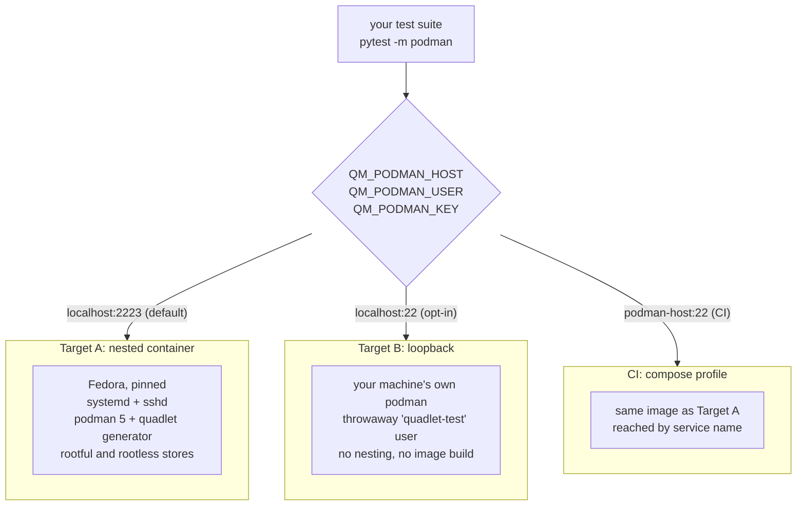

# The Podman test host

A reusable fixture for testing code that drives **real** `podman`, **real**
`systemd` and the **real** quadlet generator over SSH, instead of mocking the
command layer.

It boots a version-pinned Podman 5 host you can SSH into, in three
interchangeable places: a nested container on your machine, your own machine
directly, or a CI service container. The tests never know which.

---

## Why it exists

Agentless tools that manage remote hosts usually funnel every remote command
through one choke point, and that choke point is trivially mockable. So it gets
mocked, and then nothing ever runs the commands for real. The failure modes that
actually bite in production live below the mock:

* the rootless path (`XDG_RUNTIME_DIR`, `systemctl --user`, linger),
* real generator or tool output, including its exact error phrasing,
* real JSON shapes, which differ across tool versions,
* anything where "the command succeeded" and "the thing actually happened" can
  diverge.

This fixture gives you a disposable host where all of that is real.

---

## Shape



The target is chosen entirely by environment variables, read in **one** place.
Test bodies never mention a target, so adding a third costs one env lookup
rather than a second code path.

| Variable | Default | Meaning |
|---|---|---|
| `QM_PODMAN_HOST` | `localhost:2223` | `host:port` of the target |
| `QM_PODMAN_USER` | `editor` | SSH user |
| `QM_PODMAN_KEY` | `tests/fixtures/test_key` | private key |
| `QM_PODMAN_FORCE` | unset | clean up leftovers from a crashed run |

---

## The three options, and when to use each

### Target A, nested container (default)

A privileged container running real systemd as PID 1, with sshd and podman 5
inside. Identical to what CI runs, so it is the source of truth when the targets
disagree.

```bash
sudo ./scripts/podman-e2e.sh up      # build and boot
./scripts/podman-e2e.sh status       # reachable? (no sudo)
./scripts/podman-e2e.sh test         # run the suite
./scripts/podman-e2e.sh shell        # poke around
./scripts/podman-e2e.sh logs         # journalctl from inside
sudo ./scripts/podman-e2e.sh down
```

Use it for anything you intend to trust. Costs an image build the first time.

Only `up` and `down` need root. Everything else goes over SSH.

> The container runs under **rootful** podman, so your own `podman ps` will not
> list it and it looks like it never started. Use `sudo podman ps` or `status`.

### Target B, loopback (opt-in)

Runs against your machine's own podman as a dedicated throwaway user. No
nesting, no image build, near-instant.

```bash
sudo ./scripts/podman-e2e.sh setup-local
QM_PODMAN_HOST=localhost:22 QM_PODMAN_USER=quadlet-test \
  python -m pytest tests/ -m podman
sudo ./scripts/podman-e2e.sh teardown-local
```

Use it for a fast edit/run loop. It also grants the throwaway user only the
narrow sudoers allowlist from the project's own setup docs, which makes it the
only check that the documented policy is actually sufficient.

> **Status: written and syntax-checked, not yet exercised.** It creates a real
> user, enables linger and writes `/etc/sudoers.d/` on your machine, so verify
> it deliberately before relying on it.

> **It writes to your real `/etc/containers/systemd`.** The safety rails below
> are not optional for this target.

### CI, compose profile

One service behind a profile so existing jobs do not pay to build it:

```bash
docker compose -f docker-compose.test.yml --profile podman up -d --build
```

The profile keeps it out of the default `up`. In CI the app container reaches
the host by service name (`podman-host:22`) while the test process on the runner
reaches it on the published port.

---

## Safety rails

Target B writes to your real system directories, so this is load-bearing:

* Everything the suite creates is named with a fixed prefix (`e2e-`).
* The teardown helper **raises** rather than deletes anything whose basename
  lacks that prefix.
* A pre-flight **reports** leftovers from a crashed run instead of deleting
  them, with an explicit env var to opt into cleanup.
* Teardown runs in a `finally`, and also sweeps stray prefixed pods and
  containers, not just files.

---

## What to copy into another project

Generic, lift as-is:

| File | Purpose |
|---|---|
| `Dockerfile.podman-host` | the host image, with its build-time assertions |
| `tests/fixtures/podman-host/load-test-image.{sh,service}` | preload images into both stores at boot |
| `scripts/podman-e2e.sh` | the driver (`up`/`down`/`status`/`test`/`shell`/`logs`/`setup-local`) |
| the `podman-host` service block in `docker-compose.test.yml` | CI |
| the `podman` matrix entry and readiness gate in the workflow | CI |

Project-specific, expect to rewrite:

| File | Why |
|---|---|
| `scripts/seed_test_db.py` | registers the host in *your* app's database |
| `tests/podman/conftest.py` | the target selection and safety rails are generic; the DB seeding is not |
| `tests/fixtures/quadlets/*` | your units |
| the test modules | your code |

If your project is not QuadletManager, the minimum you need is the Dockerfile,
the driver script, and the env-var contract. Everything else is scaffolding
around your own assertions.

---

## Non-obvious requirements

These are the things that cost real debugging time. Each is asserted or
handled in the image, but if you adapt it, keep them.

**Linger.** Without `/var/lib/systemd/linger/<user>`, `/run/user/<uid>` does not
exist for a non-interactive SSH session, so every rootless command returns
*empty output rather than an error*. `loginctl` needs a running systemd, so the
image creates the marker file at build time. Have a canary test for this; it
fails in ways that point nowhere near linger.

**fuse-overlayfs.** Nested containers cannot use native overlay on an overlay
filesystem. Both the root and the user store need
`mount_program = "/usr/bin/fuse-overlayfs"`, and the host needs `/dev/fuse`.

**File capabilities on `newuidmap`.** Fedora's *container* base image ships
`newuidmap`/`newgidmap` **without** the capabilities the host RPM sets. Without
`setcap`, rootless podman inside fails with "should have setuid or have filecaps
setuid", which reads like a linger problem and is not one.

**Nested subnet collisions.** Podman's rootful default is `10.88.0.0/16` both
outside and inside. The first rootful container start creates a bridge on the
subnet the host container's own address belongs to and blackholes its route out:
the port stays open, and every new connection fails with `No route to host`.
Move the nested default elsewhere.

**Cgroups.** Use `cgroup: private` (`--cgroupns=private`). Do **not** bind-mount
`/sys/fs/cgroup` read-only as older systemd-in-container recipes do; on a
cgroup v2 host that stops nested podman from delegating cgroups.

**Build and run with the same podman.** A rootless build puts the image in your
store while `sudo podman run` looks in root's.

---

## Traps when writing tests against it

**A `podman run` over SSH can hang forever on an inherited fd.** netavark starts
a background DNS daemon for the default bridge; it inherits the SSH channel's
stdout, so the client waits for an EOF that never arrives even though the
container ran and exited. Anything that reads until EOF hangs identically.
`--network=none` "fixes" it only by starting no daemon, which makes it look like
a networking bug. Redirect to a file and read the file back.

**Stopping a container cleanly needs both an init and a TERM trap.** With no
init the payload is PID 1, the kernel applies no default signal action to PID 1,
SIGTERM is ignored and podman SIGKILLs after 10s (exit 137). With an init but no
trap the process still dies *by* SIGTERM (exit 143). systemd counts both as
failure, so `systemctl stop` leaves the unit `failed` and a lifecycle test
cannot tell a clean stop from a crash.

**Podman does not name every quadlet's unit `<base>.service`.** Only containers.
`foo.pod` generates `foo-pod.service`, and likewise `-volume` and `-network`.
Getting this wrong in *teardown* is worse than in a test: it stops a unit that
does not exist while the real one keeps running, then deletes its file.

**Host keys are pinned on first connect.** A rebuilt host presents a new one, so
an app reusing its database fails with a host-key mismatch while `ssh` from your
terminal still works. Clear the pin when re-seeding, or discard the volume.

**A committed test key is almost certainly mode 644.** Git records only the
executable bit, so every clone gets a world-readable private key, which `ssh`
refuses before falling back to a password prompt. With `DISPLAY` set that prompt
is *graphical*, once per retry. Copy the key to a mode-600 file and always pass
`BatchMode=yes` so a rejected key fails loudly instead of prompting.

---

## Verifying an adaptation

Have a canary module that runs before anything else and asserts, in order:

1. SSH reaches the expected account.
2. `podman --version` is the major version you require.
3. The generator or tool binary you shell out to exists.
4. **Rootless** `systemctl --user is-system-running` returns something. This is
   the linger canary and the single most valuable check here.
5. Rootless and rootful podman are both usable.
6. Your test image is present in **both** stores.

If those pass, failures further along are about your code. If they do not,
nothing downstream is worth debugging.
