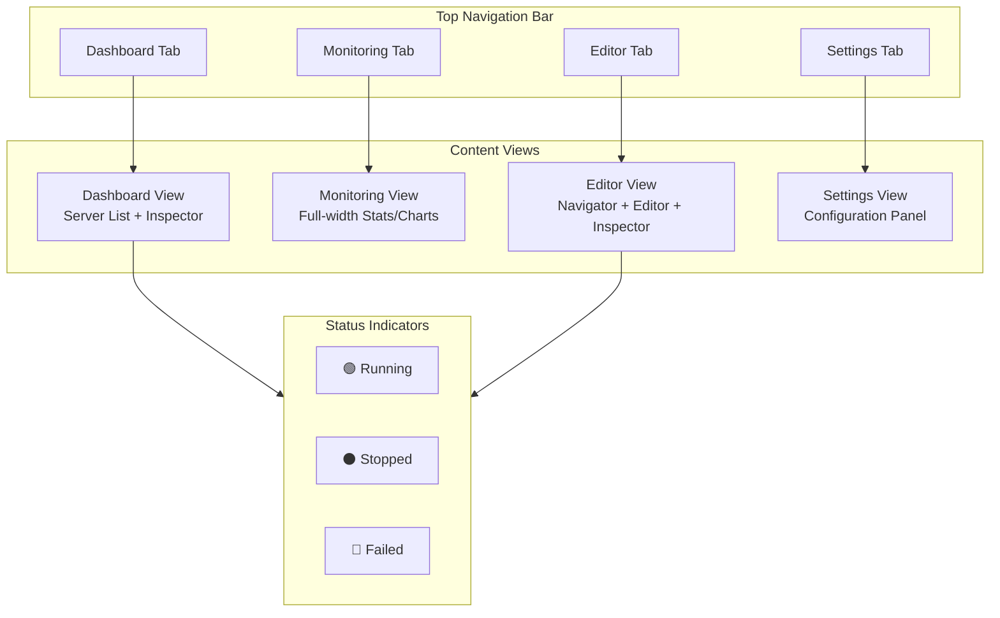

# Issue #8: UI Modernization Implementation Plan

## Executive Summary

Issue #8 is a parent epic with 5 sub-issues. After analyzing the codebase, **most features are already implemented**. This plan focuses on the remaining work.

## Current State Analysis

### Already Implemented ✅

| Sub-Issue | Feature | Status | Evidence |
|-----------|---------|--------|----------|
| #9 | Dark Theme | ✅ Complete | [`static/style.css`](static/style.css:3-27) - Full dark color scheme with CSS variables |
| #10 | Top Navigation Bar | ✅ Complete | [`templates/dashboard.html`](templates/dashboard.html:10-17) - Dashboard/Editor/Settings tabs |
| #12 | Resizable Sections | ✅ Complete | [`static/main.js`](static/main.js:327-400) - Drag handles with localStorage persistence |
| #13 | Status Dots | ⚠️ Partial | [`templates/partials/quadlet_tree.html`](templates/partials/quadlet_tree.html:12-15) - Running/Stopped states exist |

### Still Needed ❌

| Sub-Issue | Feature | Gap |
|-----------|---------|-----|
| #11 | Tabbed Metrics View | Stats are embedded in Inspector panel, need dedicated Monitoring tab |
| #13 | Failed State Detection | Status dots only show running/stopped, missing failed state |

---

## Implementation Plan

### Phase 1: Close Completed Sub-Issues

**Action:** Close issues #9, #10, and #12 with resolution comments noting they are already implemented.

### Phase 2: Implement Monitoring Tab (Issue #11)

#### 2.1 Add Monitoring Tab to Navigation

**File:** [`templates/dashboard.html`](templates/dashboard.html:10-17)

```html
<!-- Current -->
<div class="nav-links">
  <button class="nav-item active" onclick="switchTab('dashboard')">Dashboard</button>
  <button class="nav-item" onclick="switchTab('editor')">Editor</button>
  <button class="nav-item" onclick="switchTab('settings')">Settings</button>
</div>

<!-- Proposed -->
<div class="nav-links">
  <button class="nav-item active" onclick="switchTab('dashboard')">Dashboard</button>
  <button class="nav-item" onclick="switchTab('monitoring')">Monitoring</button>
  <button class="nav-item" onclick="switchTab('editor')">Editor</button>
  <button class="nav-item" onclick="switchTab('settings')">Settings</button>
</div>
```

#### 2.2 Create Monitoring Pane HTML

**File:** [`templates/dashboard.html`](templates/dashboard.html) - Add new pane

```html
<div id="monitoring-pane" class="monitoring-pane">
  <div class="header-bar">
    <h2 class="panel-title">Monitoring</h2>
    <div class="server-selector">
      <select id="monitoring-server-select" onchange="selectMonitoringServer(this.value)">
        <!-- Populated dynamically -->
      </select>
    </div>
  </div>
  <div class="monitoring-content">
    <div class="stats-container" style="height: 300px;">
      <canvas id="monitoring-chart"></canvas>
    </div>
    <div id="monitoring-stats-table" class="stats-table-wrapper">
      <!-- Stats table -->
    </div>
  </div>
</div>
```

#### 2.3 Add CSS for Monitoring Pane

**File:** [`static/style.css`](static/style.css)

```css
/* Monitoring Pane */
.monitoring-pane {
  flex: 1;
  display: flex;
  flex-direction: column;
  padding: 1.5rem;
  background-color: var(--bg-base);
}

.monitoring-content {
  flex: 1;
  display: flex;
  flex-direction: column;
  gap: 1rem;
}

/* View control for monitoring tab */
body.view-monitoring #navigator,
body.view-monitoring #editor-pane,
body.view-monitoring #inspector,
body.view-monitoring #settings-pane,
body.view-monitoring .resize-handle {
  display: none !important;
}

body.view-monitoring #monitoring-pane {
  display: flex;
}
```

#### 2.4 Update JavaScript for Monitoring Tab

**File:** [`static/main.js`](static/main.js)

- Add `switchTab('monitoring')` handling
- Create separate chart instance for monitoring view
- Add server selector population logic
- Ensure real-time stats updates work in monitoring view

### Phase 3: Enhance Status Dots (Issue #13)

#### 3.1 Add Failed State Detection

**File:** [`static/main.js`](static/main.js:65-85) - Enhance `applyStatusDots()` function

```javascript
// Need to track failed containers from systemd status
// Add new SSE event listener for 'unit_failed' or parse status output
```

**Approach:**
1. Extend the stats engine to include unit status from `systemctl is-failed`
2. Add SSE event for failed units
3. Update `applyStatusDots()` to handle failed state

#### 3.2 Add Failed State CSS

**File:** [`static/style.css`](static/style.css)

```css
.status-dot {
  display: inline-block;
  width: 8px;
  height: 8px;
  border-radius: 50%;
  margin-right: 6px;
}

.dot-running { background-color: var(--success); }
.dot-stopped { background-color: #6b7280; }
.dot-failed { 
  background-color: var(--danger);
  animation: pulse-failed 1s ease-in-out infinite;
}

@keyframes pulse-failed {
  0%, 100% { opacity: 1; box-shadow: 0 0 0 0 rgba(239, 68, 68, 0.7); }
  50% { opacity: 0.8; box-shadow: 0 0 0 4px rgba(239, 68, 68, 0); }
}
```

### Phase 4: Update Documentation

**File:** [`docs/ARCHITECTURE.md`](docs/ARCHITECTURE.md)

- Update frontend components section to reflect new Monitoring tab
- Document the status dot states and their meanings
- Update the three-pane layout diagram if structure changes

---

## Testing Strategy

### Unit Tests

1. Test `switchTab('monitoring')` function
2. Test status dot CSS class application
3. Test server selector population

### Integration Tests

1. Test SSE stats updates in monitoring view
2. Test failed state detection end-to-end
3. Test tab switching with Monaco editor layout

### Manual Testing

1. Verify all tabs work correctly
2. Verify stats chart renders in monitoring tab
3. Verify status dots show correct states
4. Verify responsive behavior

---

## Architecture Diagram



---

## Risk Assessment

| Risk | Impact | Mitigation |
|------|--------|------------|
| Breaking existing tab switching | High | Comprehensive test coverage before changes |
| SSE connection issues in new view | Medium | Reuse existing SSE infrastructure |
| Failed state detection latency | Low | Poll systemd status at existing interval |

---

## Acceptance Criteria

### Issue #11 (Monitoring Tab)
- [ ] Metrics/graphs accessible from dedicated navigation tab
- [ ] Real-time stats updates work correctly in new view
- [ ] Main dashboard decluttered - no inline graphs
- [ ] Smooth transitions when switching tabs
- [ ] No loss of existing monitoring functionality

### Issue #13 (Status Indicators)
- [ ] Green dot for running quadlets
- [ ] Black/gray dot for stopped quadlets
- [ ] Red pulsing dot for failed quadlets
- [ ] Status dots visible in all relevant views

---

## Estimated Effort

Not providing time estimates per project rules. Work is broken into clear, sequential steps above.

---

## Next Steps

1. User approval of this plan
2. Switch to Code mode for implementation
3. Implement Phase 2 (Monitoring Tab)
4. Implement Phase 3 (Failed State Detection)
5. Update documentation
6. Run tests and verify
7. Commit and close issues
